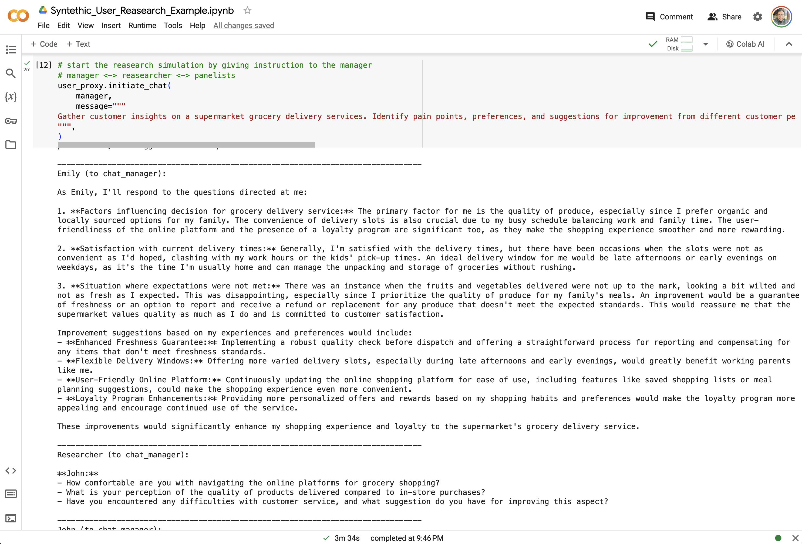

# Synthetic User Research (Persona Prompting & Autonomous Agents)

## Overview

This project explores the innovative domain of synthetic user research by leveraging generative AI and autonomous agents to simulate digital customer personas. Traditional user research methodologies face challenges such as scalability and accessing diverse user groups. Our approach, using generative AI, allows for the creation and interaction with digital personas in simulated research scenarios, unlocking unprecedented insights into consumer behaviors and preferences.



## Key Features

- **Persona Prompting**: Crafting detailed prompts to generate synthetic personas with rich backgrounds, goals, and frustrations.
- **Autonomous Agent Fusion**: Combining technology and linguistics to create digital personas that interact in simulated environments, mimicking real consumer interactions.
- **Advanced Research Frameworks**: Utilizing frameworks like Autogen, BabyAGI, and CrewAI to manage complex agent architectures and interactions.

## Getting Started

### Prerequisites

- Python 3.8 or higher
- Installation of Autogen and other necessary libraries

### Installation

Clone the repository to your local machine:

```bash
git clone https://github.com/koconder/synthetic-user-research.git
cd synthetic-user-research
```

### Running the Notebook

Open the provided Jupyter Notebook in your preferred environment, such as Jupyter Lab or Google Colab. The notebook contains detailed steps and code snippets for setting up the environment, configuring the LLM and API keys, and running the synthetic user research simulations.

## Usage

Follow the instructions within the notebook to:

1. Setup your environment and configure the Large Language Model (LLM).
2. Define personas using the persona prompting method.
3. Initialize autonomous agents and simulate user research sessions.
4. Analyze the outcomes and generate summaries using a Summary Agent.

## Contributing

We welcome contributions to this project! Whether it's adding new features, improving documentation, or reporting issues, your help is appreciated. Please feel free to submit pull requests or open issues on GitHub.

## License

This project is licensed under the [GPL-3.0 license](LICENSE) - see the LICENSE file for details.

## Acknowledgments

- Stefano De Paoli for the research workflow used in the generation of personas.
- The Autogen, BabyAGI, and CrewAI frameworks for enabling the architecture of autonomous agents.
- All contributors and users of this project.

## About the Author

Vincent Koc is a author, lecturer and futurist with extensive experience in data-driven and digital disciplines with AI. Follow Vincent on [LinkedIn](https://www.linkedin.com/in/vincentkoc) and [X](https://twitter.com/koconder).

---

*This project is a part of ongoing experiments into generative AI and agent architectures. Your feedback and contributions are welcome!*
